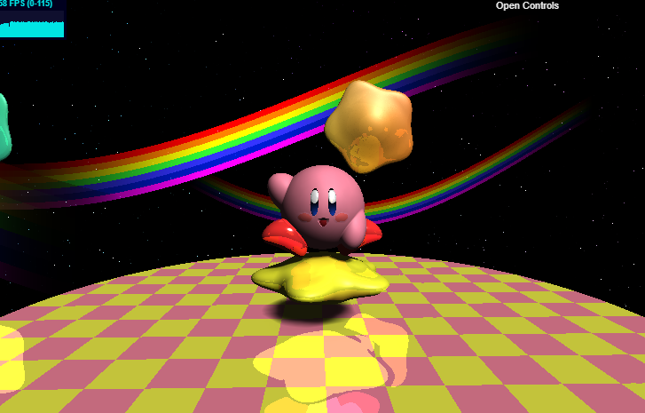
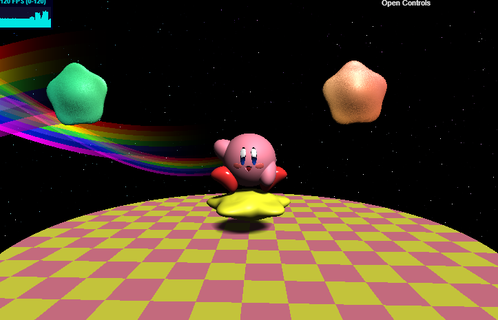
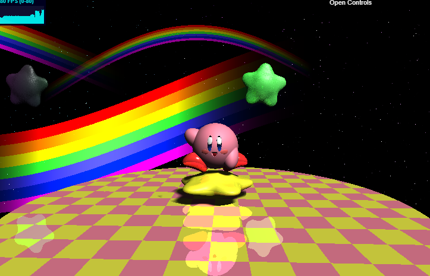
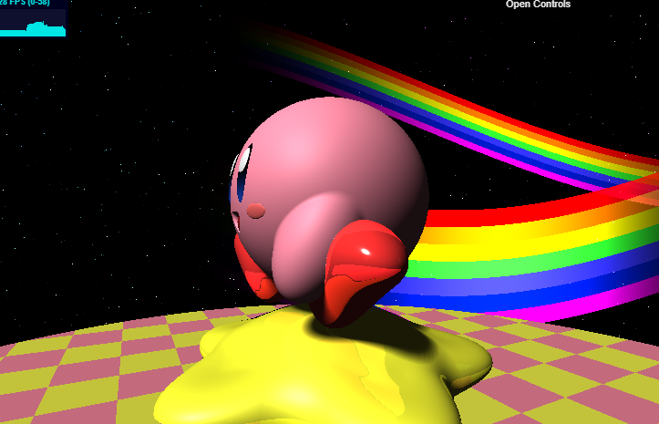
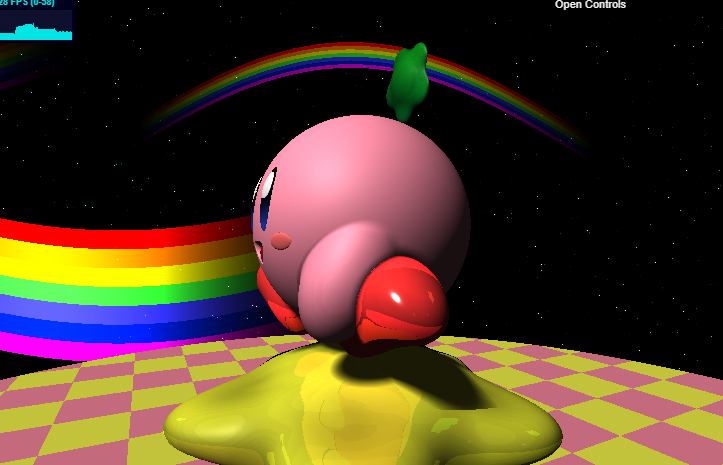
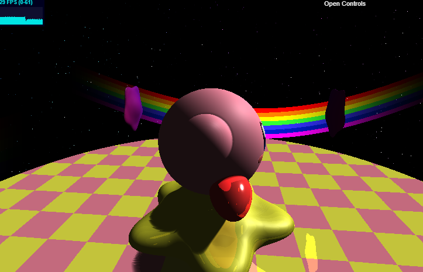
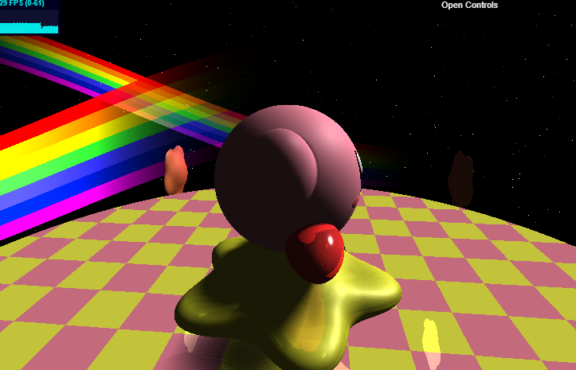
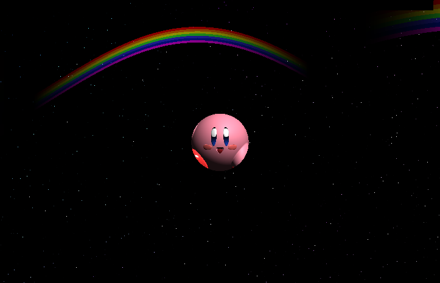

# CIS 566 Project 2: Implicit Surface

* Univer sity of Pennsylvania - CIS 566 Project 2: Implicit Surface
* pennkey : byumjin
* name : [Byumjin Kim](https://github.com/byumjin)

# Live Demo

* [Live Demo Link](https://byumjin.github.io/procedural_kirby/)
* [Youtube Link](https://www.youtube.com/watch?v=hYXqmJBNi9k)

# Overview

Using SDF(Signed Distance Function)s, I have created a [Kirby](https://www.youtube.com/watch?v=DPafFVi6BaE) and rainbow colored background. 

## Creating an animated scene

For creating the kirby's shape, I needed to use every blending operator with ratation matrix.
His body's reflection model is just PBR, but it is not enough to make some special shaders like his eyes as cartoon style which has gradient color or rainbow colors. So, I used some math to make them look differently (along their material ID).
All movements of animations are based on a certain timeSeed and its own math function.

## Reflection

This method is simple. Instead of finishing ray-marching when it hits something, if we do ray-marching again with its direction of reflection from its hit point, we can get one-further-bounced surface color.

| No Reflection | Reflection |
| --- | --- |
|  |  |

## Ambient Occlusion

Sampling the SDF along the normal with exponentially decreasing weights can get cheap ambient occlusion.

| No Ambient Occlusion | Ambient Occlusion |
| --- | --- |
|  |  |

## Soft Shadows

I refered to iq's [soft penumbra shadows](http://www.iquilezles.org/www/articles/rmshadows/rmshadows.htm).

| Hard Shadow | Soft Shadow |
| --- | --- |
|  |  |

## Optimization

### Single Triangular Screen

I used a single triangle mesh which covers the entire our screen with broaden position and UV instead of using provided screen quad mesh.

### Bounding Sphere

We can igonore the rays which never pass through our bounding sphere of each SDF.

| No Bounding Sphere | Small Bounding Sphere  |
| --- | --- |
|  |  |

## Reference

- [Íñigo Quílez's web site](http://www.iquilezles.org/index.html)
